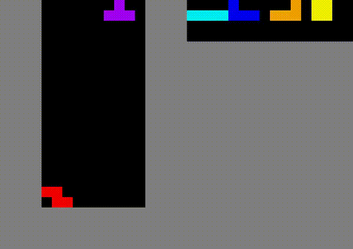

# Tetris.AI

<p align="center">
  
</p>

> Trained agent playing Tetris up to 10,000 placed pieces, clearing 4000 lines

Tetris-playing agent optimized via the **Noisy Cross-Entropy Method (CEM)**, replicating [Szita & Lőrincz (2006)](https://doi.org/10.1162/neco.2006.18.12.2936). A linear evaluation function scores board states using 22 Bertsekas & Tsitsiklis features, and CEM evolves the weight vector to maximize lines cleared.

## Setup

Install the required dependencies (numpy, gymnasium, tetris-gymnasium, tqdm, pyyaml).

```bash
pip install -r requirements.txt
```

## Usage

### Train

Run CEM optimization for 200 generations, saving weight checkpoints to `./models`.

```bash
python3 -m src.main --mode train --c src/config/tetris.yaml --o ./models --verbose
```

### Test

Play 10 games with the best learned weights and report average lines cleared.

```bash
python3 -m src.main --mode test --c src/config/tetris.yaml --o ./models --num_episodes 10 --verbose --w src/models/best_weights.npy
```

### Visualize

Record the agent playing a full game as an MP4 video.

```bash
python3 -m src.visualize --weights src/models/best_weights.npy --output ./videos
```

## Method

### The Cross-Entropy Method

CEM maintains a Gaussian distribution over the weight space and iteratively refines it. At generation $t$, the distribution is:

$$f_t \sim \mathcal{N}(\boldsymbol{\mu}_t, \, \boldsymbol{\sigma}_t^2)$$

Each generation proceeds as follows:

1. **Sample** $n = 100$ weight vectors $\mathbf{w}_1, \ldots, \mathbf{w}_n$ from $f_t$
2. **Evaluate** each $\mathbf{w}_i$ by playing a single game, obtaining fitness $S(\mathbf{w}_i)$ = lines cleared
3. **Select** the top $\rho \cdot n$ samples (with $\rho = 0.1$), denoting their index set as $I$
4. **Update** the distribution parameters:

$$\boldsymbol{\mu}_{t+1} = \frac{1}{|I|} \sum_{i \in I} \mathbf{w}_i$$

$$\boldsymbol{\sigma}_{t+1}^2 = \frac{1}{|I|} \sum_{i \in I} (\mathbf{w}_i - \boldsymbol{\mu}_{t+1})^2 + Z_{t+1}$$
